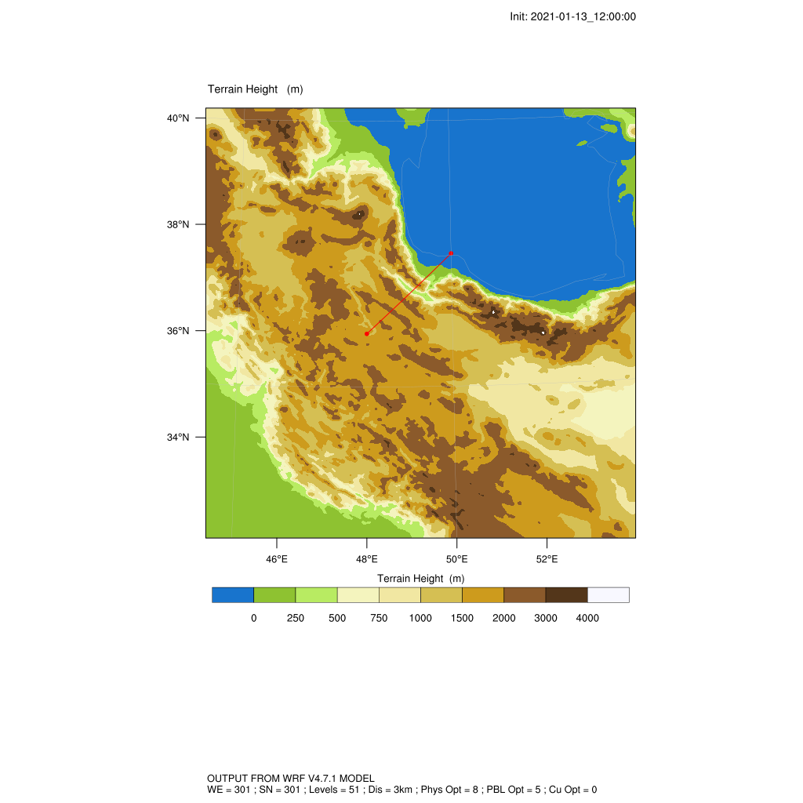
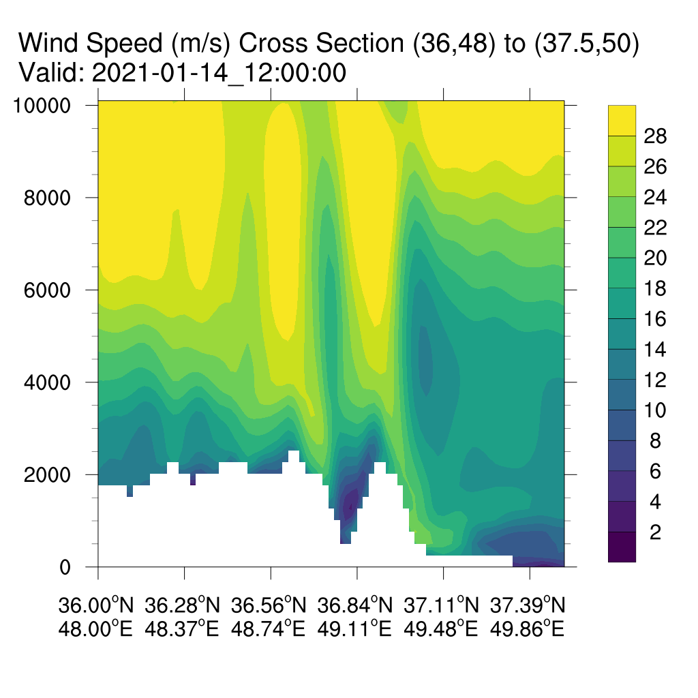
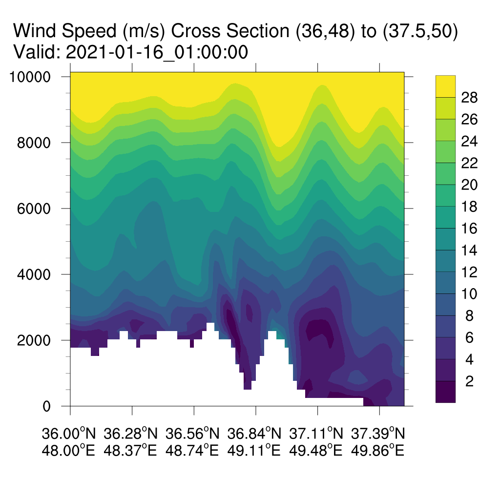
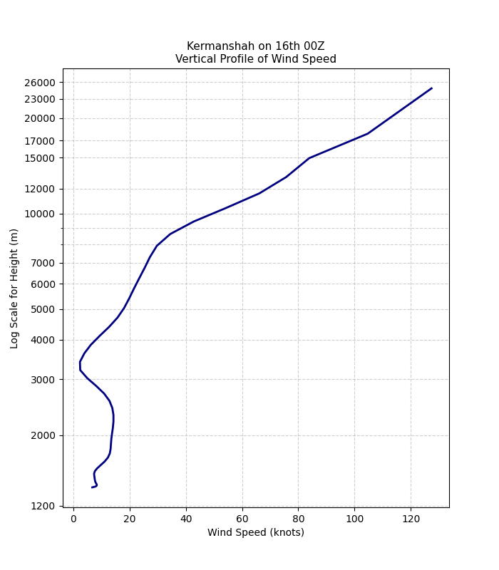
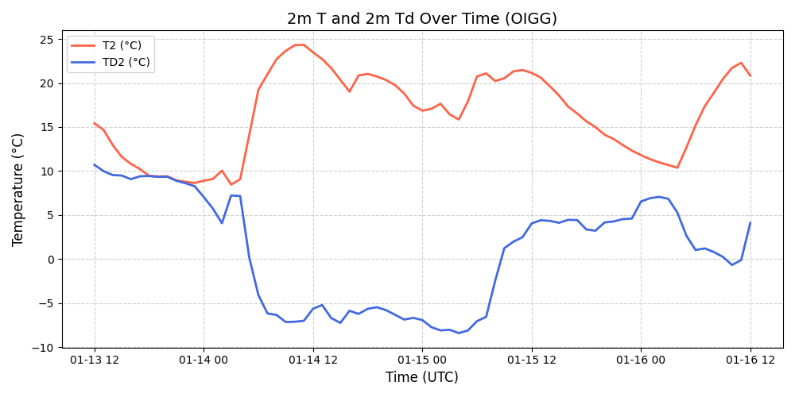

# Investigating Foehn Winds over the Alborz Mountains

## 🌄 Project Overview
This project investigates **foehn wind events** over the **Alborz Mountains, Iran**, using the **Weather Research and Forecasting (WRF)** model.  
The objective is to understand the **mechanisms and local impacts** of foehn winds, including their relationship with mountain topography, temperature gradients, and wind flow structure.

---

## 🧭 Methodology

### 1. Topography Setup
- A high-resolution **Digital Elevation Model (DEM)** was used to represent the complex terrain of the Alborz region.  
- The processed terrain data was visualized using WRF output variables (e.g., `ter`).  
- Below is an example of the topography from the innermost domain (`d03`), with the selected cross-section line marked in red for vertical analysis:



---

### 2. Model Configuration
The simulations were conducted using **WRF v4.7.1**.

#### Simulation Setup
- **Domains:** 3 nested domains (`d01` → `d02` → `d03`)
- **Input Data:** GFS Final Analysis data available every 6 hours
- **Resolution:** 27 km → 9 km → 3 km  
- **Vertical levels:** 51  
- **Physics options:**
  - Microphysics: Thompson Microphysics scheme  
  - Cumulus parameterization: Kain–Fritsch (turned off for `d03`)  
  - Planetary Boundary Layer: MYNN 3.0 scheme  
  - Surface Layer Scheme : MYNN surface layer scheme
  - Land Surface Model: Noah LSM  
  - Radiation: RRTMG shortwave and longwave schemes  

## ⚙️ Tools and Environment
- **WRF v4.7.1**
- **NCL 6.6.2** – for diagnostics and plotting
- **Python 3.11 (Matplotlib, Pandas, NumPy)** – for post-processing and plots
- **VS Code + MobaXterm** – workflow environment

#### Case Studies
Four case studies were selected based on observed foehn events.  
The **first case** runs from **January 13th 2021, 12 UTC** to **January 16th 2021, 12 UTC**.

---

### 3. Diagnostics and Visualization
- Vertical cross-sections of wind speed, temperature, and potential temperature were extracted using **NCL** (`wrf_user_vert_cross`).
- Height profiles at specific locations (e.g., **Kermanshah** and **Tehran**) were generated from model output using either NCL or Python to plot.
- Example outputs include:
  - Vertical cross-sections of wind and temperature along a transect.
  - Time series and vertical profiles of thermodynamic variables.

---

## 📊 Example Output from first case study

- Wind Speed Vertical Cross Section (foehn) on Jan 14th at 12Z.

- Wind Speed Vertical Cross Section (no foehn) on Jan 16th at 01Z.

- Wind Speed Vertical Profile at Kermanshah on the 16th at 00Z.

- Time plot of T2 and Td2 at the OIGG weather station.

- Horizontal contour map illustrating the spatial distribution of 2 m relative humidity (RH2) over a 200 × 200 km domain.


---

## 🧩 Next Steps
- Analyze remaining three case studies.  
- Compare modeled foehn events with observed station data (temperature, wind, RH).  
- Understand the mechanisms causing foehn winds.

---

## 📁 Repository Structure
```
├── data/ # Input (GFS FNL) and output data from wrfout (excluded from Git)
├── scripts/ # NCL and Python analysis scripts
│ ├── vert_cross2.ncl
│ ├── wrf_topo2.ncl
│ ├── alborz_timeplot.py   # and more scripts
├── First_casestudy/ # Figures and visualizations for 14th Jan to 16th.
├── Second_casestudy/ # Figures and visualizations for 16th Jan to 19th.
└── namelist.input # WRF configuration file
 
```